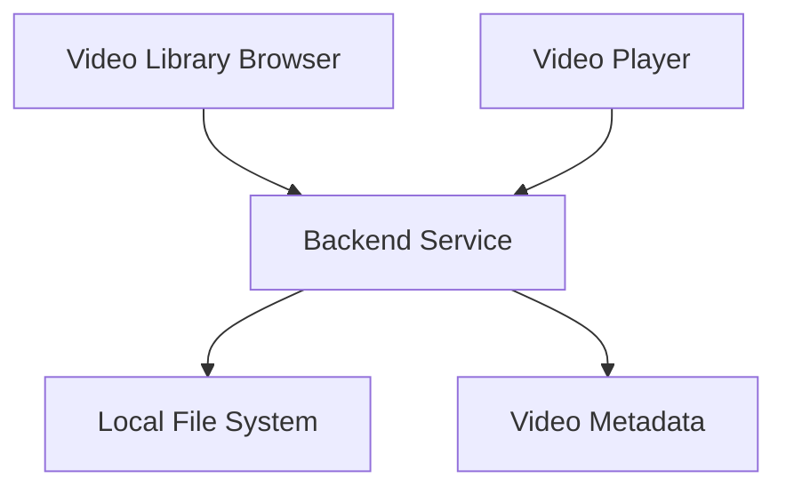

# Software Requirements Specification (SRS)

## 5.1 Introduction

The Video Player Library is a web-based application designed to provide users with a customizable platform for browsing and playing local video files through a modern browser interface. The system consists of three main components: a video library browser, a customizable video player, and a backend service for file system integration.

The remainder of this document is structured as follows. Section 5.2 contains the functional requirements organized as user stories. Section 5.3 contains performance requirements that specify system behavior and constraints. Section 5.4 details the development and execution environment requirements.

## 5.2 Functional Requirements

The functional requirements are presented as user stories to better align with Agile development methodology. Each story represents a specific feature or capability from the user's perspective.

### 5.2.1 Video Library Management

As a media enthusiast, I want to browse my local video collection through a web interface, so that I can easily access my videos without using a traditional media player.

5.2.1.1 The system shall scan and display videos from user-specified local directories.
- Will support common video formats (MP4, MOV, AVI, MKV)
- Will display video thumbnails in a grid layout
- Should update the library in real-time when new files are added

5.2.1.2 The system shall provide video metadata display.
- Will show video duration, file size, and format
- Will display creation date and last modified date
- Should support custom tags and descriptions

### 5.2.2 Video Playback

As a developer, I want to experiment with video player implementations, so that I can create custom playback experiences.

5.2.2.1 The system shall provide basic video playback controls.
- Will include play, pause, and seek functionality
- Will support volume control and muting
- Will display current playback time and duration

5.2.2.2 The system shall support advanced playback features.
- Will allow playback speed adjustment
- Will support frame-by-frame navigation
- Should provide keyboard shortcuts for all controls

### 5.2.3 User Interface

As a user, I want a modern and responsive interface, so that I can easily navigate my video library on any device.

5.2.3.1 The system shall provide an intuitive navigation system.
- Will include search and filter capabilities
- Will support sorting by various metadata fields
- Should remember user preferences

## 5.3 Performance Requirements

### 5.3.1 Video Loading Time

5.3.1.1 The system shall begin video playback within 3 seconds of selection.
- Will implement efficient video streaming
- Should support adaptive quality based on network conditions

### 5.3.2 Library Scanning

5.3.2.1 The system shall complete initial library scan within 30 seconds for up to 1000 videos.
- Will implement background scanning for large libraries
- Should cache scan results for faster subsequent loads

### 5.3.3 Response Time

5.3.3.1 The system shall respond to user interface actions within 100ms.
- Will implement client-side caching
- Should optimize DOM operations for smooth performance

## 5.4 Environment Requirements

### 5.4.1 Development Environment Requirements

- Node.js (v18 or higher)
- TypeScript 5.0+
- Next.js 14.0+
- Git for version control
- VS Code or similar IDE
- Chrome DevTools for debugging

### 5.4.2 Execution Environment Requirements

#### Hardware Requirements:
- Processor: Modern multi-core CPU (Intel i5/AMD Ryzen 5 or better)
- RAM: 8GB minimum
- Storage: Sufficient for video library + 1GB for application
- Network: 100Mbps+ for smooth local streaming

#### Software Requirements:
- Modern web browser (Chrome 90+, Firefox 90+, Safari 15+)
- Operating System: Windows 10/11, macOS 10.15+, or Linux
- Node.js runtime for backend services
- File system access permissions

The exceptional RAM requirement is necessary to support video processing and thumbnail generation. The modern browser requirement ensures support for the latest video playback and web technologies used in the application. 